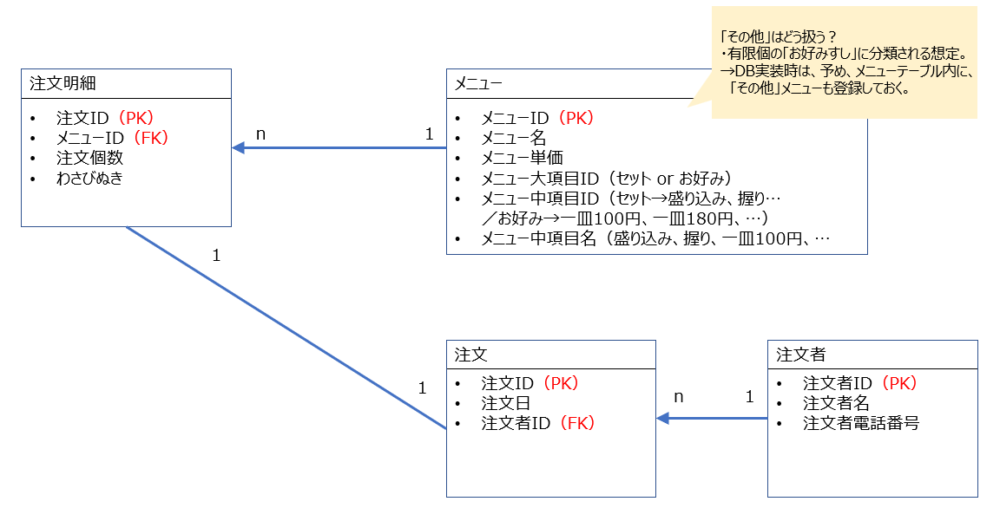
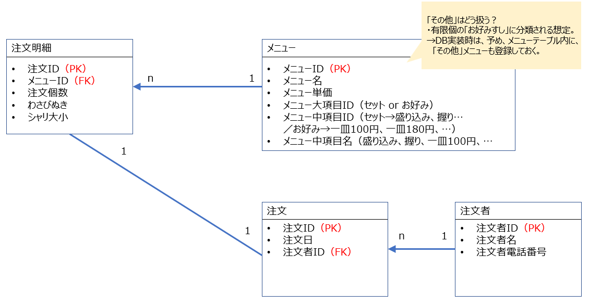
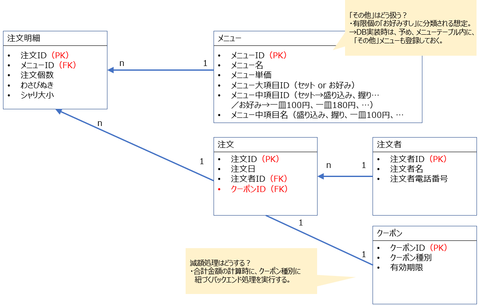

# DMモデリング1
## 課題1
* 注文票データのDBスキーマスケッチ

  * **深掘りたいポイント** 
   「メニュー」のエンティティに、”メニュー大項目”、”メニュー中項目”の属性は追加すべきかどうか？
    * 要件次第？
      紙の注文票→店員が、何かのインターフェースを介し、注文を登録する。このインターフェース実装時に、大項目・中項目があったほうが、ビュー作成楽かも。
      大・中項目があったほうが、保守・運用コストが下がる気がする。項目レベルの値下げキャンペーンへの対応とか、項目別の集計とか。
    * メニューIDのネーミングルール内に表現すれば十分では？
      避けたほうが良いと考える。分類の変更、追加が発生したときの影響が大きい。というか、Identifier定義方法のベストプラクティスとか知りたいので、別途確認。
    * 大項目「お好み」の中項目が、「一皿100円」、「一皿180円」…と価格毎なのはどうなの？
     直感的な違和感はあるが、店員さんが注文登録するインターフェースも価格で分けるだろうし、良いのでは？

* [任意課題] 物理モデルと論理モデルの違い
  * そもそもデータモデルって何？
      データモデルは、データ体型をダイアグラムなどを使い、モデル化して表現したもの。
  * データモデル分類：論理データモデル、物理データモデル
    * 論理データモデル
      エンティティ、関係、キーが識別される、抽象的なデータのモデル → 属性完備のER図のイメージ。
    * 物理データモデル
      データが実際に、データベースにどのように存在するかを記述する表現。テーブル名、列名、列数、列のデータ型が表現される。
      論理データモデル → 物理データモデル 時に、論理→物理データモデル時、エンティティはテーブルに、関係は外部キー制約に変換される。
      トリガーやストアドプロシージャなどのデータやコンポーネントに適用される制約も含む。
  
---
  
## 課題2
  * 要件追加対応①：シャリ大小選択の追加
    * 「注文明細」にシャリの属性追加。
    

  * 要件追加対応②：寿司ネタ売上個数の把握
    * 前項からの変更不要。
      → 大項目・中項目の属性をSQLの条件式に組み込むことで、「寿司ネタが毎月何個売れているのか」を出力する実装が負荷低く実装できる為。
      → 本当？（メニュー名を全量条件式に加えて、、、よりは楽そう。）他にいい設計ある？

---

## 課題3
  * 今後も発生しそうな追加仕様
    * 以下の3種クーポン割引に対応したい。クーポンは、紙の想定。
      1. 全体金額から、5%割引
      2. 全体金額から、10%割引
      2. お好みすし10皿につき、600円引き（＝お好みすしが、どれでも一皿無料！のイメージ）
  * 仕様変更への対応
    * 一旦、上記要件にのみ対応するスキーマスケッチ
    