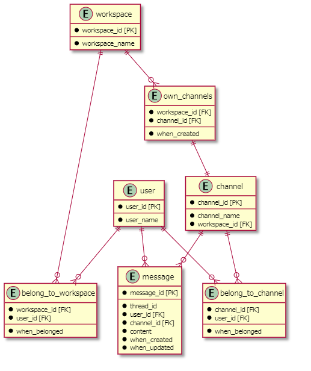

# DMモデリング2
## 課題1
### DBモデリングのポイント
  * 中間テーブル（belong_to_workspace, belong_to_channel, own_channels）は、サロゲートキーを不要とした。
    * 複合キー（外部キー×2）により、一意にレコードが特定可能である為
    * 複合キーの一異性が崩れる将来的な仕様変更が考えられないため
  * メッセージとスレッドのテーブルは分轄せず、thread_id を持たせる。
    * スレッドの子メッセージのthread_idは、rootメッセージ（スレッドの最上位メッセージ）のthread_idを参照する
  * 横断的なメッセージ検索は、messageテーブル内で検索をかける。
    * スレッドとメッセージを別管理していないため、横断的に検索可能。

### 議論したいポイント
  1. ワークスペースからの脱退・チャネルからの脱退を、テーブル上でどのように処理するべきか？
  * 中間テーブル（belong_to~）上で、レコードを物理削除する想定をしている。
    * 再参加容易であり、論理削除するメリットが小さい
    * 誤削除→再参加の間に、失われる情報が特に無い…？
 
