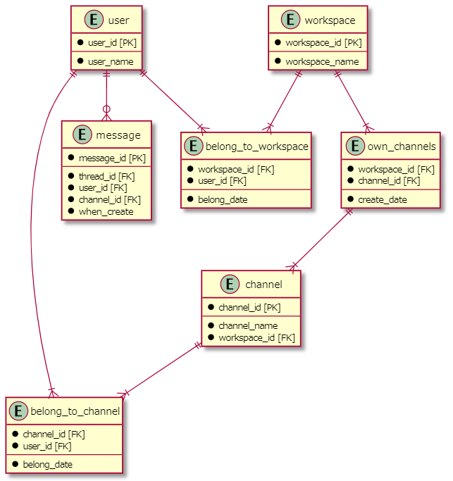

# DMモデリング2
## 課題1
* ざっと思いついた形式でモデリング
  * ユーザー ↔ ワークスペース・チャネル、ワークスペース ↔ チャネル間には、リレーションをエンティティとして追加。

  * ユーザーの属性に、リレーションを表す belong_to_workspace, belong_to_channel の id を格納する配列を追加。

  * ワークスペースの属性に、リレーションを表す own_channels の id を格納する配列を追加。

 
* 課題を考察
  1. belong, own （リレーション）の id を配列としてカラムに持たせた場合、要件通りの検索制限をかけられるのか？
  2. "own_channels"は必要なのか？
